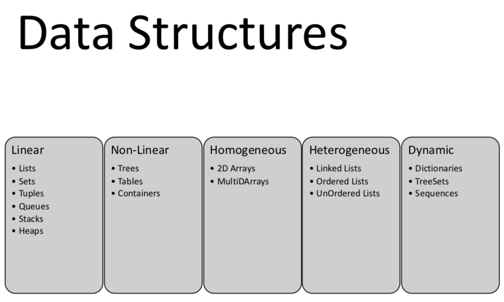

<h1>Learn GoLang and Data Structures together.</h1>

<b>Lists</b>
<ul>
<li>A list is a sequence of elements.</li>
<li>Lists have a variable length and developer can remove or add elements more easily than an array.</li>

</ul>

