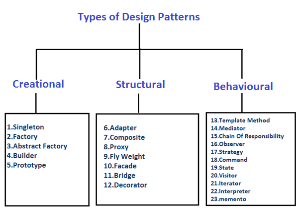

<h1>Learn GoLang's Design Patterns and Data Structures together.</h1>
<h2>Design Patterns</h2>



<b>Adapter Design Pattern (Structural)</b>

<ul>
<li>
The adapter pattern provides a wrapper with an interface required by the API client to link incompatible types and act as a translator between the two types.</li>
<li>
The adapter uses the interface of a class to be a class with another compatible interface.</li>
<li>The adapter pattern comprises the target, adaptee, adapter, and client:
<ol>
<li>
Target is the interface that the client calls and invokes methods on the adapter and adaptee.
</li>
<li>
The client wants the incompatible interface implemented by the adapter.
</li>
<li>
The adapter translates the incompatible interface of the adaptee into an interface that the client wants.
</li>
</ol>
</li>
<li> <b>Code Example</b>

```go
package main

// importing fmt package
import (
	"fmt"
)

//IProcess interface
type IProcess interface {
	process()
}

//Adaptee Struct
type Adaptee struct {
	adapterType int
}

//Adapter struct
type Adapter struct {
	adaptee Adaptee
}

//Adapter class method process
func (adapter Adapter) process() {
	fmt.Println("Adapter process")
	adapter.adaptee.convert()
}

// Adaptee class method convert
func (adaptee Adaptee) convert() {
	fmt.Println("Adaptee convert method")
}

// main method
func main() {

	//this is how an interface is binding to class
	var processor IProcess = Adapter{}
	processor.process()
}

```

</li>
<li> <b> output</b> go run adapter_pattern.go <br/>

```cmd
Adapter process
Adaptee convert method
```

</li>
</li>
</ul>

</hr>


<b>Lists</b>

<ul>
<li>A list is a sequence of elements.</li>
<li>Lists have a variable length and developer can remove or add elements more easily than an array.</li>
<li><b> Code Example </b>

```go
package main

// importing fmt and container list packages
import (
	"container/list"
	"fmt"
)

// main method
func main() {
	var intList list.List

	intList.PushBack(5)
	intList.PushBack(6)
	intList.PushBack(7)
	intList.PushBack(10)
	intList.PushFront(0)

	display(intList)

	println("Removed from Front :", intList.Front().Value.(int))

	intList.Remove(intList.Front())

	println("Removed from Back :", intList.Back().Value.(int))

	intList.Remove(intList.Front())

	display(intList)
}

func display(intList list.List) {
	for element := intList.Front(); element != nil; element = element.Next() {
		fmt.Print(element.Value.(int), "\t")
	}
	println("\n Total Items ", intList.Len())
}

```

</li>
<li>
<b> Output for command 'go run lists.go' </b>

```cmd
0       5       6       7       10
 Total Items  5
Removed from Front : 0
Removed from Back : 10
6       7       10
 Total Items  3
```

</li>
</ul>
<hr/>
<b>Tuples</b> <br/>
<ul>
<li>A tuple is a finite sorted list of elements. It is a data structure that groups data. Tuples are typically immutable sequential collections. </li>
<li>The element has related fields of different datatypes.</li>
<li> <b> Code Example</b>

```go
package main

import (
	"fmt"
)

//gets the powerToNumber of integer num and returns tuple of square of num and cube of num
func powerToNumber(num int) (int, int) {
	return num * num, num * num * num
}

//gets the powerToNumberByNamedTuple of integer num and returns named tuple of square of num and cube of num
func powerToNumberByNamedTuple(num int) (square int, cube int) {
	square = num * num
	cube = num * num * num
	return square, cube
}

// main method
func main() {
	var square int
	var cube int

	square, cube = powerToNumber(3)
	fmt.Println("Square ", square, "Cube", cube)

	square, cube = powerToNumberByNamedTuple(5)
	fmt.Println("Square ", square, "Cube", cube)
}
```

</li>
<li> Output of command "go run tuples.go" <br/>

```cmd
Square  9 Cube 27
Square  25 Cube 125
```

</li>
</ul>
<hr/>
